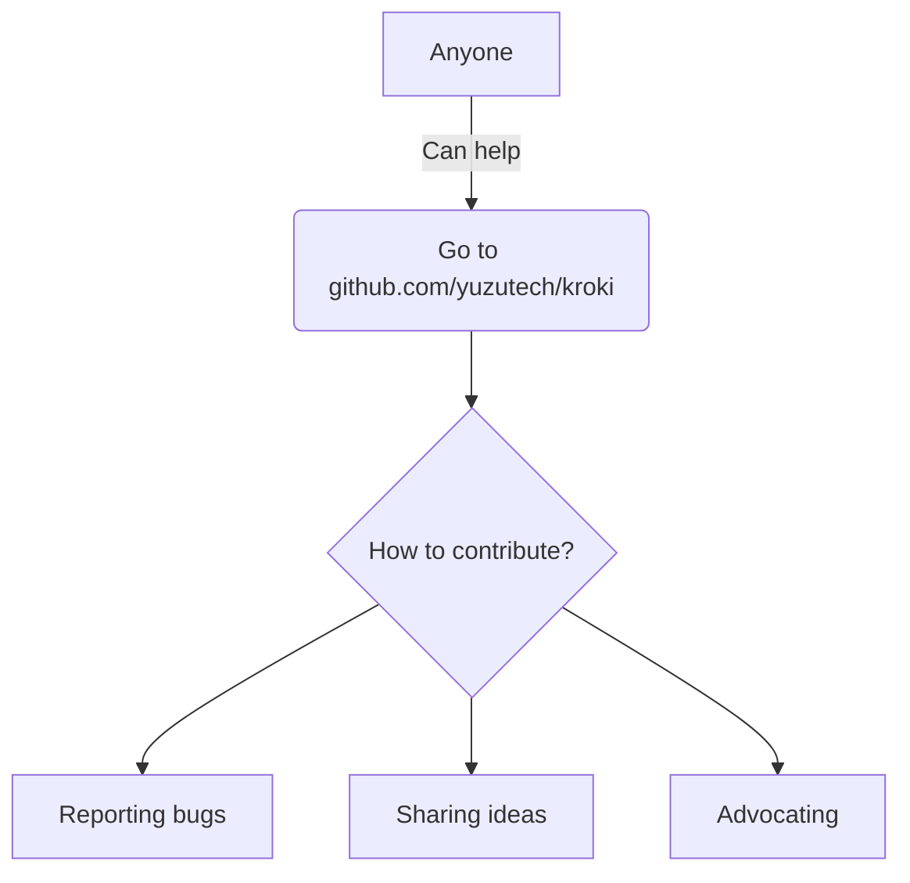

# Pandoc Kroki Filter

This is a pandoc filter that converts code blocks into diagrams using
[kroki.io](https://kroki.io/)!

````md
```blockdiag
blockdiag {
  Kroki -> generates -> "Block diagrams";
  Kroki -> is -> "very easy!";

  Kroki [color = "greenyellow"];
  "Block diagrams" [color = "pink"];
  "very easy!" [color = "orange"];
}
```


````

## Usage

Install it with pip:

```sh
pip install git+https://gitlab.com/myriacore/pandoc-kroki-filter.git
```

And use it like any other pandoc filter:

```sh
pandoc example/sample.md -o example/sample.pdf --filter pandoc-kroki
```

See the provided [example markdown](example/sample.md) and the [example
pdf](example/sample.pdf) for a better understanding of what types of diagrams
are supported via kroki, and how to use them.

## Configuration

### `KROKI_SERVER`

By default, this filter will use `https://kroki.io/` as the endpoint for the
kroki server. If you want to use http, or are self-hosting and want to use
_your own_ kroki server, you can use the `KROKI_SERVER` environment variable:

```sh
KROKI_SERVER='https://kroki.my.domain/' pandoc example/sample.md -o example/sample.pdf --filter pandoc-kroki
```

### `KROKI_DIAGRAM_BLACKLIST`

If you don't want the filter to process certain diagram types, you can add these
to the `KROKI_DIAGRAM_BLACKLIST` environment variable. This is a comma-separated
value which holds all of the diagram types that will be ignored by the kroki
filter.

For example, the following command will blacklist mermaid and plantuml
diagrams - they will appear as plain code blocks.

```sh
KROKI_DIAGRAM_BLACKLIST=mermaid,plantuml pandoc example/sample.md -o example/sample-bl.pdf --filter pandoc-kroki
```

You can see the result of this command in
[example/sample-bl.pdf](example/sample-bl.pdf).

## Caveats

Currently, the mermaid support is kinda flaky, as you'll be able to see from the
Mermaid section in [the example pdf](example/sample.pdf). The bubble for the
graph appears, but the text apparently doesn't, for whatever reason.

This bug appears to affect pdfs only, which is a shame. To avoid the jank, I
recommend you blacklist mermaid diagrams with the `KROKI_DIAGRAM_BLACKLIST`
variable, and use my [mermaid filter
fork](https://github.com/MyriaCore/pandoc-mermaid-filter) to process mermaid
diagrams instead, or just try to use a non-pdf format.
