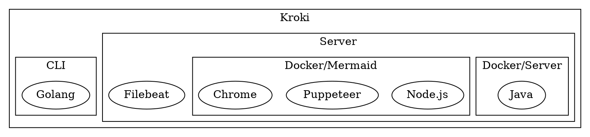
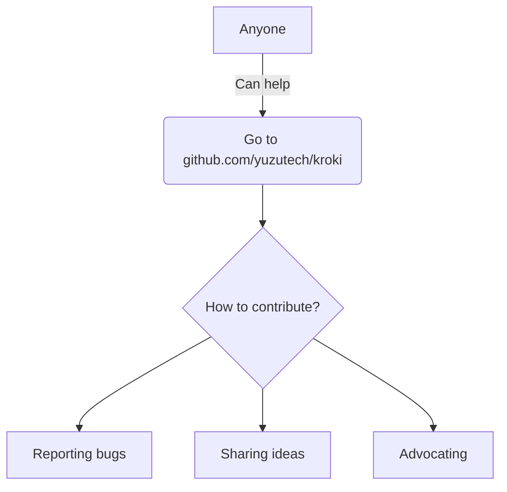

# Pandoc Kroki Filter

This is a pandoc filter that converts code blocks into diagrams using
[kroki.io](https://kroki.io/)!

````md
```blockdiag
blockdiag {
  Kroki -> generates -> "Block diagrams";
  Kroki -> is -> "very easy!";

  Kroki [color = "greenyellow"];
  "Block diagrams" [color = "pink"];
  "very easy!" [color = "orange"];
}
```



You can also use the `dot` synonymn when working with graphviz as well.


````

## Usage

Install it with pip:

```sh
pip install git+https://github.com/MyriaCore/pandoc-mermaid-filter.git
```

And use it like any other pandoc filter:

```sh
pandoc sample.md -o sample.pdf --filter pandoc-kroki
```

## Configuration

By default, this filter will use `https://kroki.io/` as the endpoint for the
kroki server. If you want to use http, or are self-hosting and want to use
*your own* kroki server, you can use the `KROKI_SERVER` environment variable:

```sh
KROKI_SERVER='https://kroki.my.domain/' pandoc sample.md -o sample.pdf --filter pandoc-kroki
```
